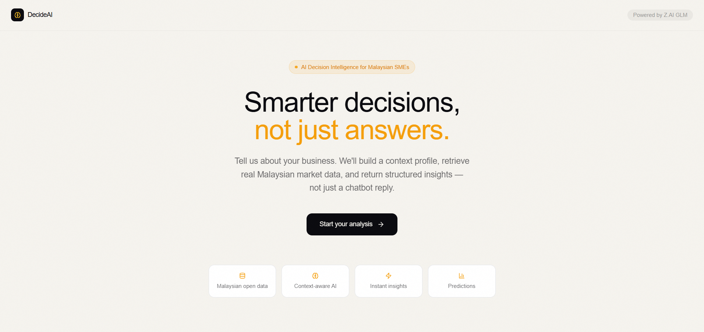
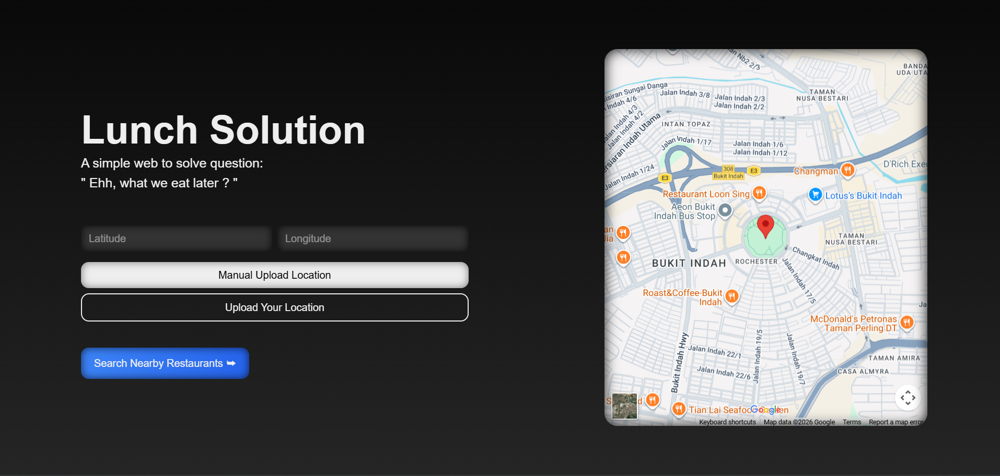
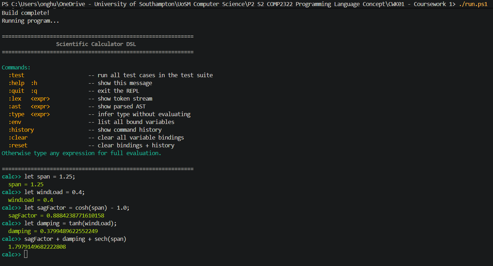
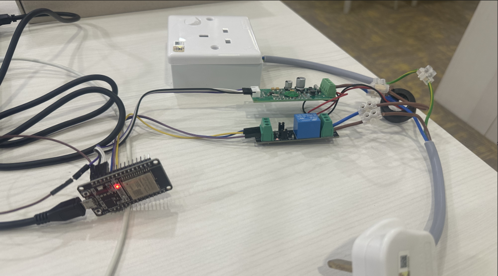

<!-- Header -->

# 👋 Hi, I'm Hua Yu

### Computer Science @ University of Southampton Malaysia
#### 🇲🇾 Johor Bahru &nbsp;|&nbsp; 🇸🇬 Singapore

---

## 🧑‍💻 About Me

- 🎓 2nd Year CS student at **University of Southampton Malaysia** — First Class (77.8%)
- 🔭 Currently building: full-stack apps and IoT systems
- 🌱 Learning: advanced type systems, distributed systems, cloud architecture
- 🏆 **Top Quadrant Award** @ Meta Research internship (2025)
- 🥋 Taekwondo Black Belt, 2nd Dan
- ♟️ Founder & VP — UoSM Cards & Boardgames Club
- 💬 Ask me about: Haskell, embedded C++, or energy monitoring systems

---

## 🛠️ Tech Stack

### Languages

### Frontend & Frameworks

### Backend & Data

### Hardware & Embedded

### Tools

---

## 🚀 Featured Projects

<table>
  <tr>
    <td width="50%" valign="top">
      <h3>🤖 DecideAI — UMHackathon 2026</h3>
      
RAG-based decision intelligence tool for Malaysian SMEs and reasoning process done by Gemini. Built end-to-end during UMHackathon 2026 with Team 404_Not_Found.

      

        <a href="https://github.com/OswaldLim/UMHackathon">🔗 View Repo</a>
        &nbsp;&nbsp;
        <a href="">🌐 View Website</a>
      
      
      
        
      

        
        
        
      

    </td>
    <td width="50%" valign="top">
      <h3>🌐 Lunch Solution — Full-Stack Web App</h3>
      
End-to-end web application with REST backend, relational database schema, and Google API integration. Deployed publicly on Vercel with CI/CD pipeline.

      

        <a href="">🔗 View Repo</a>
        &nbsp;&nbsp;
        <a href="">🌐 View Website</a>
      
      
      
        
      

        
        
        
        
      

    </td>
  </tr>
  <tr>
    <td width="50%" valign="top">
      <h3>🧮 Scientific Calculator DSL</h3>
      
Complete language pipeline built from scratch in Haskell: lexer (Alex) → parser (Happy) → type checker → evaluator → interactive REPL. Supports arithmetic, let-bindings, and conditionals.

       
      
        
      

        
      

    </td>
    <td width="50%" valign="top">
      <h3>⚡ Synergy6 — Smart Home Energy System</h3>
      
Full-stack IoT energy monitoring dashboard. Real-time control of home appliances via ESP32, PZEM-004T power sensor, and relay modules. Complete software stack: dynamic charts, weather API, automated rule engine, cross-platform packaging.

      
        
      

        
        
        
        
      

    </td>
  </tr>
</table>

---

## 📊 GitHub Stats

---

## 📫 Connect with Me

---

  

<!-- Snake animation — add this via GitHub Actions workflow, see note below -->
<!--  -->
